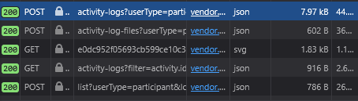

# ayp

more conveniently add logs to <https://www.onlinerecordbook.org/>

## usage

```sh
bun run ./index.ts
```

## setup

1. Copy `ayp.json.example` and rename to `ayp.json` (`cp ayp.json.example ayp.json`)
2. Login to ORB and copy your award id into the config file (`awardId`) (the end of the url, `https://www.onlinerecordbook.org/fo/dashboard/awards/<awardId>`)
3. Open DevTools (inspect element) and open the Network tab.
4. Click on one of your activities and add any log (can be deleted after).
5. Click on first POST request sent. 
6. Copy the `Authorization` header value and put it in the config file (`auth`).
7. Copy the `Cookie` header value and put it in the config file (`cookie`).
8. Copy the `User-Agent` header value and put it in the config file (`userAgent`).

Steps 3-8 may have to be done periodically (when sessions expire) or on every new login.
